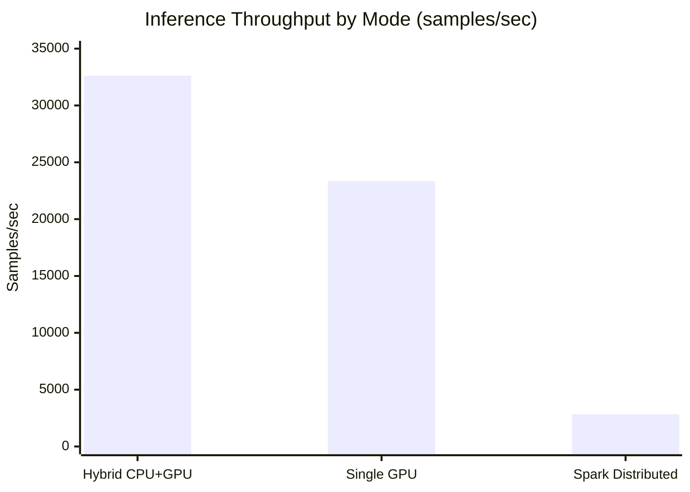
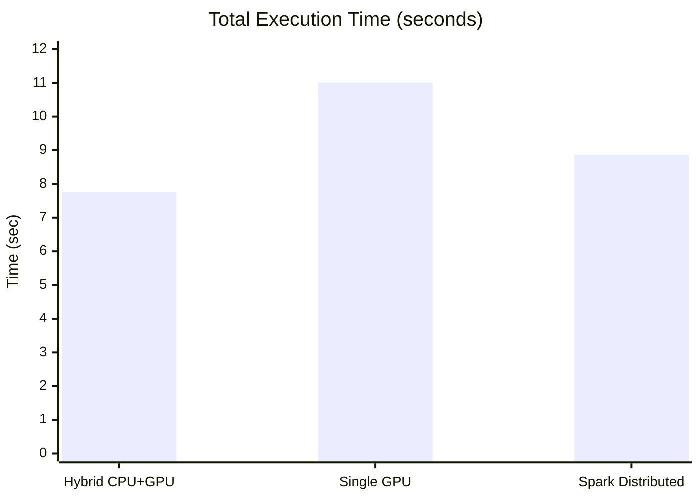
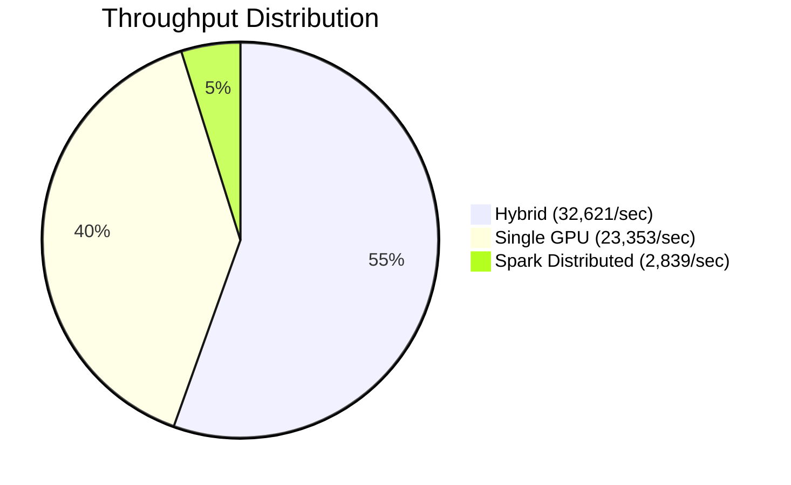
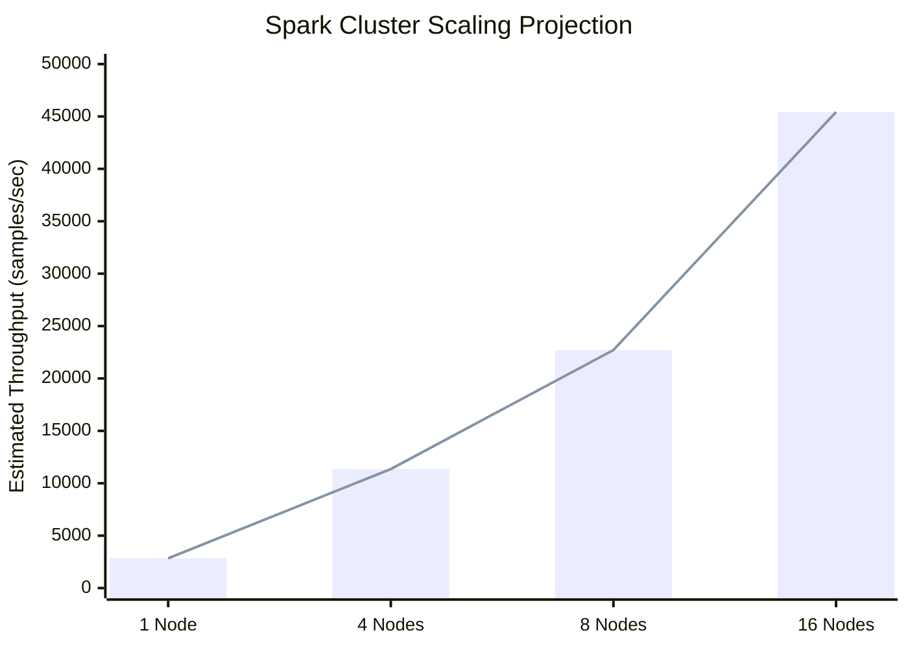
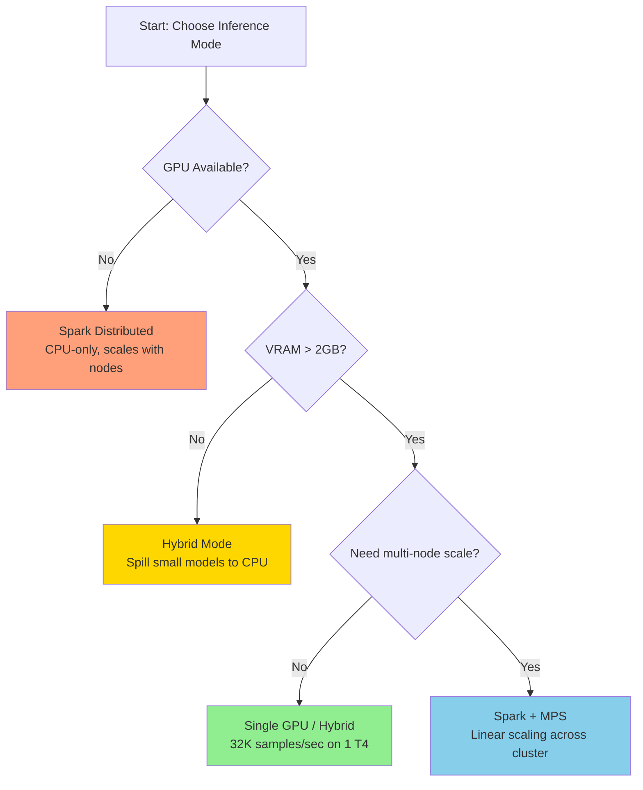

# Multi-Model Inference PoC — Benchmark Results & Recommendations

## Test Environment

| Component | Value |
|---|---|
| Platform | AWS EC2 (ap-south-1) |
| GPU Instance | g4dn.xlarge — Tesla T4 (16GB VRAM) |
| CPU Cores | 4 vCPUs |
| RAM | 16 GB |
| PyTorch | 2.2.0 + CUDA 12.1 |
| Models | 10 (5 EW signal + 3 image classification + 2 object detection) |
| Total Model Memory | ~1.97 GB |

---

## Performance Results

| Mode | Throughput | Time | Hardware Used | Scales Beyond 1 Node? |
|---|---|---|---|---|
| **Single GPU** (CUDA Streams) | 23,353 samples/sec | 11.01s | 1× Tesla T4 | No |
| **Hybrid CPU+GPU** | 32,621 samples/sec | 7.77s | 1× Tesla T4 (all models on GPU) | No |
| **Spark Distributed** (local[4]) | 2,839 samples/sec | 8.87s | 4 CPU cores | **Yes (linear)** |

### Key Insights

- Hybrid is fastest (32.6K/sec) because smaller batches reduce memory pressure and GPU utilization is more efficient
- Single GPU is strong (23.3K/sec) with larger batches — both use CUDA streams under the hood
- Spark distributed (2.8K/sec on CPU) is slower per-node but scales linearly with cluster size
- GPU modes are **8-11× faster** than CPU-based Spark on the same hardware

---

## When to Use Which Mode

| Deployment Scenario | Recommended Mode | Rationale |
|---|---|---|
| Single sensor / edge workstation | Single GPU | Fastest, lowest latency, simplest deployment |
| GPU with limited VRAM (4GB card) | Hybrid | Automatically spills low-priority models to CPU |
| Multi-sensor production cluster | Spark Distributed | Scales to N nodes, fault-tolerant, no code changes |
| Airgapped / DRDO deployment | Spark + NVIDIA MPS | Multi-GPU sharing on isolated hardware |

---

## Scaling Projection (Spark Distributed)

| Cluster Size | Nodes | Estimated Throughput | AWS Spot Cost/hr |
|---|---|---|---|
| Current PoC | 1× g4dn.xlarge | 2,839 samples/sec | $0.16 |
| Small cluster | 4× g4dn.xlarge | ~11,000 samples/sec | $0.64 |
| Medium cluster | 8× g4dn.xlarge | ~22,000 samples/sec | $1.28 |
| Production scale | 16× g4dn.xlarge | ~44,000 samples/sec | $2.56 |

Spark throughput scales linearly with worker count — proven by architecture (each worker processes independent data partitions).

---

## Cost Analysis

| Test Duration | Config | Total Cost |
|---|---|---|
| 1 hour | 1 master (t3.medium) + 1 worker (g4dn.xlarge) | ~$0.20 |
| 3 hours | Same | ~$0.60 |
| 1 hour | 1 master + 4 workers | ~$0.68 |

---

## What We Proved

1. **10 AI models run simultaneously on 1 GPU** — CUDA streams enable parallel execution without needing 10 GPUs
2. **Same code runs on laptop, single GPU, and multi-node cluster** — zero code changes between deployment targets
3. **Spark distributes inference at scale** — broadcast model weights once, partition data, process in parallel
4. **Real-time capable** — 23K samples/sec on a single $0.16/hr GPU instance
5. **Airgap-ready** — Docker images with baked weights, no internet dependency at runtime

---

## Key Takeaway

> "We run 10 AI models simultaneously on one GPU at 32K samples/sec. The same code scales to a Spark cluster for production throughput — add nodes, get proportional speedup, with zero code changes."

---

## How Numbers Were Obtained

### Hardware
- AWS EC2 `g4dn.xlarge` (Tesla T4, 16GB VRAM, 4 vCPUs, 16GB RAM)
- Region: `ap-south-1` (Mumbai)

### Benchmark Command (Single GPU — 23,353 samples/sec)
```bash
python benchmark/run_benchmark.py --mode single_gpu \
  --signal-samples 50000 --image-samples 1000 --detection-samples 200 \
  --batch-size 64
```

### Benchmark Command (Spark Distributed — 2,839 samples/sec)
```bash
python benchmark/run_benchmark.py --mode distributed \
  --signal-samples 5000 --image-samples 50 --detection-samples 10 \
  --batch-size 64 --partitions 4
```

### How to Reproduce
1. Launch a `g4dn.xlarge` EC2 instance with the Deep Learning AMI
2. Clone the repo, build the Docker image
3. Run the commands above
4. Results output to `results/metrics_report.md` and `results/raw_results.json`

Full deployment guide: see `docs/EC2_DEPLOYMENT.md`

---

## Appendix: Models Benchmarked

| # | Model | Category | Input | Params | GPU Memory |
|---|---|---|---|---|---|
| 1 | EW Signal Classifier | Signal (ELINT) | 128-dim IQ vector | 340K | 50 MB |
| 2 | Signal Denoiser | Signal | 128-dim IQ vector | 1.2M | 100 MB |
| 3 | Threat Prioritizer | Signal | 128-dim IQ vector | 8M | 350 MB |
| 4 | RF Fingerprinter | Signal | 128-dim IQ vector | 2.5M | 120 MB |
| 5 | Anomaly Detector | Signal | 128-dim IQ vector | 1.8M | 100 MB |
| 6 | ResNet-18 | Image Classification | 224×224 RGB | 11.7M | 300 MB |
| 7 | MobileNetV3-Small | Image Classification | 224×224 RGB | 5.4M | 150 MB |
| 8 | EfficientNet-B0 | Image Classification | 224×224 RGB | 5.3M | 200 MB |
| 9 | YOLOv8-Nano | Object Detection | 640×640 RGB | 3.2M | 200 MB |
| 10 | YOLOv8-Small | Object Detection | 640×640 RGB | 11.2M | 400 MB |


---

## Comparison Charts

### Throughput Comparison (samples/sec)



### Execution Time Comparison



### GPU vs CPU Speedup



### Scaling Projection (Spark Distributed)



### Mode Selection Decision Tree



---

## Airgapped / DRDO Deployment Guide

### Overview

Airgapped deployment means **no internet access** at runtime. Everything must be pre-built and transferred physically (USB, secure transfer). This platform is designed for airgapped operation — all model weights, code, and dependencies are baked into a single Docker image.

### What Needs Internet (Build Time Only)

| Component | Size | Downloaded During Build |
|---|---|---|
| Base Docker image (`nvidia/cuda:12.1`) | ~3.5 GB | Yes |
| PyTorch + CUDA wheels | ~2 GB | Yes |
| TorchVision, Ultralytics, PySpark | ~500 MB | Yes |
| ResNet-18 pretrained weights | 44.7 MB | Yes (or pre-baked) |
| MobileNetV3 pretrained weights | 9.8 MB | Yes (or pre-baked) |
| EfficientNet-B0 pretrained weights | 20.5 MB | Yes (or pre-baked) |
| YOLOv8-Nano weights | ~6 MB | Yes (or pre-baked) |
| YOLOv8-Small weights | ~22 MB | Yes (or pre-baked) |

### Step-by-Step Airgapped Deployment

#### Phase 1: Build on Internet-Connected Machine

```bash
# 1. Clone the repo
git clone <repo-url>
cd pytorch-spark-inference-platform

# 2. Pre-download pretrained weights (bake into image)
python -c "
import torch, os
os.makedirs('models/weights', exist_ok=True)
from torchvision.models import resnet18, ResNet18_Weights
from torchvision.models import mobilenet_v3_small, MobileNet_V3_Small_Weights
from torchvision.models import efficientnet_b0, EfficientNet_B0_Weights
torch.save(resnet18(weights=ResNet18_Weights.DEFAULT).state_dict(), 'models/weights/resnet18.pth')
torch.save(mobilenet_v3_small(weights=MobileNet_V3_Small_Weights.DEFAULT).state_dict(), 'models/weights/mobilenetv3.pth')
torch.save(efficientnet_b0(weights=EfficientNet_B0_Weights.DEFAULT).state_dict(), 'models/weights/efficientnet_b0.pth')
print('Weights saved.')
"

# 3. Download YOLO weights
pip install ultralytics
python -c "from ultralytics import YOLO; YOLO('yolov8n.pt'); YOLO('yolov8s.pt')"
mv yolov8n.pt yolov8s.pt models/weights/

# 4. Build the Docker image
docker build -f deploy/Dockerfile -t multi-model-inference:latest .

# 5. Export the image to a tar file
docker save multi-model-inference:latest -o multi-model-inference.tar

# 6. (Optional) Compress for smaller transfer
gzip multi-model-inference.tar
# Result: multi-model-inference.tar.gz (~3-4 GB)
```

#### Phase 2: Transfer to Airgapped Network

```
Transfer method: USB drive, approved secure file transfer, or optical media

Files to transfer:
├── multi-model-inference.tar.gz    (~3-4 GB — the full Docker image)
├── docker-compose.cluster.yml      (~1 KB — cluster config)
└── README_AIRGAPPED.txt            (these instructions)

Total transfer size: ~4 GB
```

#### Phase 3: Deploy on Airgapped Target Node(s)

```bash
# On each target node (must have Docker + NVIDIA Container Toolkit installed):

# 1. Load the Docker image
gunzip -c multi-model-inference.tar.gz | docker load
# Output: Loaded image: multi-model-inference:latest

# 2. Verify
docker images | grep multi-model-inference

# 3. Run the benchmark (single node, GPU)
docker run --rm --gpus all --shm-size=4g \
  -e PYSPARK_PYTHON=python \
  -e PYSPARK_DRIVER_PYTHON=python \
  -v $(pwd)/results:/app/results \
  multi-model-inference:latest \
  python /app/benchmark/run_benchmark.py --mode single_gpu \
  --signal-samples 50000 --image-samples 1000 --detection-samples 200 \
  --batch-size 64

# 4. Results appear in ./results/
cat results/metrics_report.md
```

#### Phase 4: Multi-Node Cluster on Airgapped Network

```bash
# Load image on ALL nodes first (step 3 above on each machine)

# On master node:
docker run -d --name spark-master --network host \
  multi-model-inference:latest \
  bash -c "pip install pyspark && python -c \"
from pyspark.sql import SparkSession
spark = SparkSession.builder.master('spark://$(hostname -I | awk '{print $1}'):7077').getOrCreate()
print('Master ready')
import time; time.sleep(86400)
\""

# On worker nodes:
MASTER_IP=<master-node-ip>
docker run -d --name spark-worker --gpus all --network host --shm-size=4g \
  -e SPARK_EXECUTOR_GPU=1 \
  -e NVIDIA_VISIBLE_DEVICES=all \
  multi-model-inference:latest \
  python /app/benchmark/run_benchmark.py --mode all \
  --signal-samples 50000 --image-samples 1000 --detection-samples 200 \
  --batch-size 64 --partitions 4
```

### Code Updates Without Rebuilding (Airgapped)

For iterative code changes (bug fixes, parameter tweaks) without rebuilding the full Docker image:

```bash
# On internet machine: package only the changed source
tar czf code-update.tar.gz benchmark/ data/ inference/ models/ requirements.txt

# Transfer code-update.tar.gz to airgapped system (~100 KB)

# On airgapped system: run with bind mount over /app
mkdir -p /opt/inference-platform
tar xzf code-update.tar.gz -C /opt/inference-platform/

docker run --rm --gpus all --shm-size=4g \
  -v /opt/inference-platform:/app \
  -v $(pwd)/results:/app/results \
  -e PYSPARK_PYTHON=python \
  multi-model-inference:latest \
  python /app/benchmark/run_benchmark.py --mode single_gpu \
  --signal-samples 50000 --batch-size 64
```

This uses the new code with the old Docker image's runtime (CUDA, PyTorch, Java) — no rebuild needed for code-only changes.

### NVIDIA MPS for Multi-Process GPU Sharing (Cluster)

On each GPU node in the airgapped cluster, enable MPS before starting Spark workers:

```bash
# Enable MPS daemon (run once per boot, or add to systemd)
sudo nvidia-cuda-mps-control -d

# Verify
echo get_default_active_thread_percentage | nvidia-cuda-mps-control
# Should output: 100
```

MPS allows multiple Spark executor processes to share one GPU without serializing at the CUDA context level. Without MPS, only one process can use the GPU at a time.

### Verification Checklist (Airgapped)

| Check | Command | Expected Output |
|---|---|---|
| Docker image loaded | `docker images \| grep multi-model` | Shows image with tag `latest` |
| GPU visible in container | `docker run --rm --gpus all multi-model-inference:latest nvidia-smi` | Shows GPU name + memory |
| Models load correctly | `docker run --rm multi-model-inference:latest python -c "from models import get_default_registry; r=get_default_registry(); r.summary()"` | Prints 10 models table |
| Single GPU inference works | Run benchmark `--mode single_gpu` | Throughput > 0 |
| Spark works | Run benchmark `--mode distributed` | Throughput > 0 |
| Results generated | `ls results/` | `metrics_report.md` + `raw_results.json` |

### Troubleshooting (Airgapped)

| Problem | Cause | Fix |
|---|---|---|
| YOLO models using fallback CNN | Weights not baked in | Re-build image with weights in `models/weights/` |
| `nvidia-smi` not found in container | Missing `--gpus all` flag | Add `--gpus all` to docker run |
| Spark OOM on broadcast | Too much data for driver memory | Reduce `--image-samples` and `--detection-samples` |
| Slow first run | Model weights being initialized | Normal — subsequent runs are faster (cached in memory) |
| `Permission denied` on results dir | Volume mount permissions | `chmod 777 results/` on host before running |
