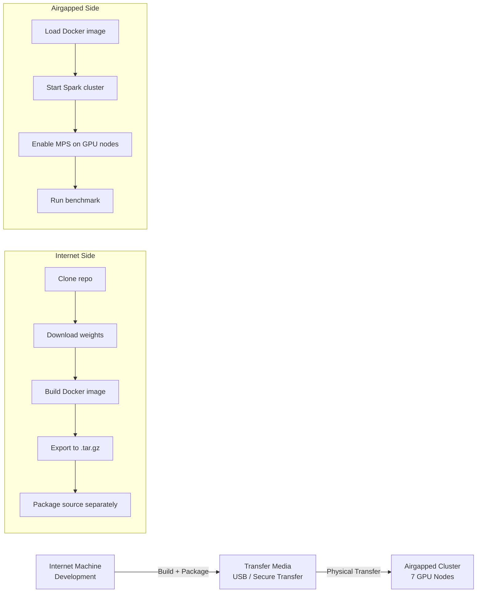

# Internet to Airgapped Transfer — Complete Workflow

How to take this codebase from an internet-connected development machine and deploy it on a fully isolated (airgapped) clustered environment with Docker and GPU support.

---

## Transfer Overview



---

## Phase 1: Prepare on Internet-Connected Machine

### 1.1 Clone Repository

```bash
git clone <repo-url>
cd pytorch-spark-inference-platform
```

### 1.2 Download All Pretrained Weights

These are the files that require internet. Once baked into the Docker image, no internet is ever needed again.

```bash
mkdir -p models/weights

# TorchVision models (ResNet-18, MobileNetV3, EfficientNet-B0)
python -c "
import torch
from torchvision.models import resnet18, ResNet18_Weights
from torchvision.models import mobilenet_v3_small, MobileNet_V3_Small_Weights
from torchvision.models import efficientnet_b0, EfficientNet_B0_Weights

torch.save(resnet18(weights=ResNet18_Weights.DEFAULT).state_dict(), 'models/weights/resnet18.pth')
torch.save(mobilenet_v3_small(weights=MobileNet_V3_Small_Weights.DEFAULT).state_dict(), 'models/weights/mobilenetv3.pth')
torch.save(efficientnet_b0(weights=EfficientNet_B0_Weights.DEFAULT).state_dict(), 'models/weights/efficientnet_b0.pth')
print('Done: torchvision weights saved')
"

# YOLO weights
pip install ultralytics
python -c "from ultralytics import YOLO; YOLO('yolov8n.pt'); YOLO('yolov8s.pt')"
mv yolov8n.pt yolov8s.pt models/weights/

# Verify (should be ~100 MB total)
ls -lh models/weights/
```

### 1.3 Build Docker Image

```bash
docker build -f deploy/Dockerfile -t multi-model-inference:latest .
# Takes 10-15 minutes (downloads CUDA base image, PyTorch, all pip deps)
```

### 1.4 Verify Image Works

```bash
# Quick check — prints 10 models
docker run --rm multi-model-inference:latest \
  python -c "from models import get_default_registry; r=get_default_registry(); r.summary()"

# Full test (if GPU available on build machine)
docker run --rm --gpus all --shm-size=4g multi-model-inference:latest \
  python /app/benchmark/run_benchmark.py --mode single_gpu \
  --signal-samples 1000 --image-samples 100 --detection-samples 20 --batch-size 64
```

### 1.5 Export Docker Image

```bash
# Export (uncompressed: ~7 GB)
docker save multi-model-inference:latest -o multi-model-inference.tar

# Compress (takes 5-10 min, result: ~3-4 GB)
gzip multi-model-inference.tar

ls -lh multi-model-inference.tar.gz
# ~3.5 GB
```

### 1.6 Package Source Code Separately (for future updates)

```bash
# Lightweight package for code-only updates (~100 KB)
tar czf code-update.tar.gz \
  benchmark/ data/ inference/ models/ deploy/ requirements.txt

ls -lh code-update.tar.gz
# ~100 KB
```

### 1.7 (Optional) Package Spark Standalone

If the airgapped system doesn't have Spark installed:

```bash
wget https://archive.apache.org/dist/spark/spark-3.5.1/spark-3.5.1-bin-hadoop3.tgz
ls -lh spark-3.5.1-bin-hadoop3.tgz
# ~400 MB
```

### 1.8 Create Transfer Package

```
transfer-package/
├── multi-model-inference.tar.gz        (~3.5 GB)  Docker image with everything
├── code-update.tar.gz                  (~100 KB)  Source code for future updates
├── spark-3.5.1-bin-hadoop3.tgz         (~400 MB)  Optional: Spark standalone
├── docker-compose.cluster.yml          (~1 KB)    Cluster compose file
├── INTERNET_TO_AIRGAPPED_TRANSFER.md   (~15 KB)   This document
└── AIRGAPPED_DEPLOYMENT.md             (~10 KB)   Deployment instructions

Total: ~4 GB
```

---

## Phase 2: Physical Transfer

### Transfer Methods

| Method | Security Level | Speed | Notes |
|---|---|---|---|
| Encrypted USB drive | Medium | Fast | Most common for lab environments |
| Data diode (one-way) | High | Medium | Hardware-enforced one-way transfer |
| Optical media (DVD/BD) | High | Slow | Write-once, tamper-evident |
| Approved file transfer system | Varies | Medium | Organization-specific tooling |

### Verification After Transfer

On the airgapped system, verify file integrity:

```bash
# Check file sizes match
ls -lh multi-model-inference.tar.gz
# Should be ~3.5 GB (same as source)

# Optional: checksum verification
# On internet machine: sha256sum multi-model-inference.tar.gz > checksums.txt
# Transfer checksums.txt
# On airgapped: sha256sum -c checksums.txt
```

---

## Phase 3: Setup Airgapped Cluster

### 3.1 Cluster Architecture

```
┌─────────────────────────────────────────────────────────────────────┐
│                    Airgapped Network (No Internet)                   │
│                                                                     │
│  ┌───────────────┐                                                  │
│  │  Master Node  │  ← Spark Driver, submit jobs, Spark UI          │
│  │  (any machine)│     No GPU required                              │
│  └───────┬───────┘                                                  │
│          │ Spark RPC (port 7077)                                     │
│          │                                                           │
│  ┌───────┼───────┬───────────┬───────────┬──────────┬──────────┐   │
│  ▼       ▼       ▼           ▼           ▼          ▼          ▼   │
│ ┌─────┐ ┌─────┐ ┌─────┐   ┌─────┐   ┌─────┐  ┌─────┐  ┌─────┐  │
│ │GPU 1│ │GPU 2│ │GPU 3│   │GPU 4│   │GPU 5│  │GPU 6│  │GPU 7│  │
│ │Node │ │Node │ │Node │   │Node │   │Node │  │Node │  │Node │  │
│ │     │ │     │ │     │   │     │   │     │  │     │  │     │  │
│ │MPS  │ │MPS  │ │MPS  │   │MPS  │   │MPS  │  │MPS  │  │MPS  │  │
│ │Spark│ │Spark│ │Spark│   │Spark│   │Spark│  │Spark│  │Spark│  │
│ │Wrkr │ │Wrkr │ │Wrkr │   │Wrkr │   │Wrkr │  │Wrkr │  │Wrkr │  │
│ └─────┘ └─────┘ └─────┘   └─────┘   └─────┘  └─────┘  └─────┘  │
└─────────────────────────────────────────────────────────────────────┘
```

### 3.2 Prerequisites on Each Node

Verify BEFORE going airgapped (install these while internet is available):

```bash
# On each node:
docker --version          # Docker 20.10+
nvidia-smi                # NVIDIA driver 525+
docker run --rm --gpus all nvidia/cuda:12.1.0-base-ubuntu22.04 nvidia-smi  # Container toolkit

# If any of these fail, install while internet is available:
# Docker: https://docs.docker.com/engine/install/ubuntu/
# NVIDIA Driver: sudo apt install nvidia-driver-535
# Container Toolkit: https://docs.nvidia.com/datacenter/cloud-native/container-toolkit/install-guide.html
```

### 3.3 Load Docker Image on All Nodes

```bash
# On EVERY node (master + all 7 GPU workers):
gunzip -c multi-model-inference.tar.gz | docker load
# Takes 2-3 minutes per node

# Verify
docker images | grep multi-model-inference
# REPOSITORY               TAG       SIZE
# multi-model-inference    latest    ~7 GB
```

### 3.4 Install Spark Standalone (If Not Using Docker-Only Mode)

```bash
# On every node:
tar xzf spark-3.5.1-bin-hadoop3.tgz -C /opt/
echo 'export SPARK_HOME=/opt/spark-3.5.1-bin-hadoop3' >> ~/.bashrc
echo 'export PATH=$SPARK_HOME/bin:$SPARK_HOME/sbin:$PATH' >> ~/.bashrc
source ~/.bashrc

# Verify
spark-submit --version
```

### 3.5 Enable NVIDIA MPS on All GPU Nodes

```bash
# On each GPU worker node:
sudo nvidia-cuda-mps-control -d

# Make persistent (survives reboot):
sudo tee /etc/systemd/system/nvidia-mps.service << 'EOF'
[Unit]
Description=NVIDIA MPS Daemon
After=nvidia-persistenced.service

[Service]
Type=forking
ExecStart=/usr/bin/nvidia-cuda-mps-control -d
ExecStop=/bin/echo quit | /usr/bin/nvidia-cuda-mps-control
Restart=on-failure

[Install]
WantedBy=multi-user.target
EOF

sudo systemctl enable nvidia-mps
sudo systemctl start nvidia-mps
```

---

## Phase 4: Start Spark Cluster

### 4.1 Start Master (on designated master node)

```bash
$SPARK_HOME/sbin/start-master.sh
# Master URL: spark://<MASTER_HOSTNAME>:7077
# Web UI: http://<MASTER_HOSTNAME>:8080
```

### 4.2 Start Workers (on each GPU node)

```bash
MASTER_IP=<master-node-ip>
$SPARK_HOME/sbin/start-worker.sh spark://${MASTER_IP}:7077 -c 4 -m 12g
```

### 4.3 Verify Cluster

Open `http://<MASTER_IP>:8080` — should show 7 workers connected.

---

## Phase 5: Run Benchmarks

### Option A: Independent Mode (Each Node Runs Alone)

Simplest — doesn't require Spark cluster setup:

```bash
# On each GPU node independently:
docker run --rm --gpus all --shm-size=4g \
  -e PYTORCH_CUDA_ALLOC_CONF=expandable_segments:True \
  -v $(pwd)/results:/app/results \
  multi-model-inference:latest \
  python /app/benchmark/run_benchmark.py --mode single_gpu \
  --signal-samples 50000 --image-samples 1000 --detection-samples 200 \
  --batch-size 64
```

Each node produces ~42K samples/sec. Total cluster capacity: 7 × 42K = **~294K samples/sec**.

### Option B: Spark Distributed (Coordinated Across Cluster)

```bash
# From master node:
docker run --rm --network host --shm-size=4g \
  -e PYSPARK_PYTHON=python \
  -e PYSPARK_DRIVER_PYTHON=python \
  -e SPARK_EXECUTOR_GPU=1 \
  -v $(pwd)/results:/app/results \
  multi-model-inference:latest \
  python /app/benchmark/run_benchmark.py --mode distributed \
  --signal-samples 50000 --image-samples 500 --detection-samples 100 \
  --batch-size 64 --partitions 14
```

Note: `--partitions 14` = 2 partitions per GPU node (7 nodes × 2).

### Option C: All Modes Comparison (On Single Node)

```bash
# Single GPU (fastest per node)
docker run --rm --gpus all --shm-size=4g \
  -e PYTORCH_CUDA_ALLOC_CONF=expandable_segments:True \
  -v $(pwd)/results_single:/app/results \
  multi-model-inference:latest \
  python /app/benchmark/run_benchmark.py --mode single_gpu \
  --signal-samples 50000 --image-samples 1000 --detection-samples 200 --batch-size 64

# Hybrid
docker run --rm --gpus all --shm-size=4g \
  -e PYTORCH_CUDA_ALLOC_CONF=expandable_segments:True \
  -v $(pwd)/results_hybrid:/app/results \
  multi-model-inference:latest \
  python /app/benchmark/run_benchmark.py --mode hybrid \
  --signal-samples 50000 --image-samples 1000 --detection-samples 200 --batch-size 32

# Spark Distributed GPU
docker run --rm --gpus all --shm-size=4g \
  -e PYSPARK_PYTHON=python -e PYSPARK_DRIVER_PYTHON=python \
  -e SPARK_EXECUTOR_GPU=1 \
  -e PYSPARK_SUBMIT_ARGS="--driver-memory 8g --conf spark.driver.maxResultSize=4g pyspark-shell" \
  -v $(pwd)/results_distributed:/app/results \
  multi-model-inference:latest \
  python /app/benchmark/run_benchmark.py --mode distributed \
  --signal-samples 5000 --image-samples 50 --detection-samples 10 --batch-size 64 --partitions 2

# View all results
cat results_single/metrics_report.md
cat results_hybrid/metrics_report.md
cat results_distributed/metrics_report.md
```

---

## Phase 6: Code Updates (Without Rebuilding Docker Image)

When you need to change Python code (bug fixes, new models, parameter tweaks):

### On Internet Machine:

```bash
# Make code changes, then package
cd pytorch-spark-inference-platform
tar czf code-update-v2.tar.gz benchmark/ data/ inference/ models/
# ~100 KB — transfer via USB
```

### On Airgapped System:

```bash
# Extract new code
mkdir -p /opt/inference-platform
tar xzf code-update-v2.tar.gz -C /opt/inference-platform/

# Run with new code overlaid on existing Docker image
docker run --rm --gpus all --shm-size=4g \
  -v /opt/inference-platform:/app \
  -v $(pwd)/results:/app/results \
  -e PYTORCH_CUDA_ALLOC_CONF=expandable_segments:True \
  multi-model-inference:latest \
  python /app/benchmark/run_benchmark.py --mode single_gpu \
  --signal-samples 50000 --batch-size 64
```

The `-v /opt/inference-platform:/app` bind mount overrides the code inside the container with your updated code. The Docker image's runtime (CUDA, PyTorch, Java) is still used.

### When Full Rebuild Is Required

| Change | Need Rebuild? | Transfer Size |
|---|---|---|
| Python code (.py files) | No — bind mount | ~100 KB |
| New model weights | No — bind mount weights dir | ~50 MB |
| New pip package | Yes | ~4 GB (full image) |
| PyTorch upgrade | Yes | ~4 GB |
| CUDA version change | Yes | ~4 GB |
| Dockerfile change | Yes | ~4 GB |

---

## Troubleshooting (Airgapped-Specific)

| Problem | Cause | Fix |
|---|---|---|
| `docker load` fails: "no space left on device" | Disk full | Clear old images: `docker system prune -a` |
| Models download weights at runtime | Weights not pre-baked | Rebuild image with Step 1.2 weights |
| Spark workers can't connect to master | Firewall/network | Ensure port 7077 is open between nodes |
| MPS not working | Daemon not started | Run `sudo nvidia-cuda-mps-control -d` on each GPU node |
| `CUDA out of memory` | Batch too large | Reduce `--batch-size` (try 32 or 16) |
| Spark broadcast OOM | Data too large | Reduce `--image-samples` and `--detection-samples` |

---

## Summary: What Goes Where

| Component | Internet Machine | Transfer | Airgapped System |
|---|---|---|---|
| Source code | Git clone | code-update.tar.gz (100 KB) | `/opt/inference-platform/` |
| Docker image | `docker build` | multi-model-inference.tar.gz (4 GB) | `docker load` |
| Model weights | Downloaded by build | Inside Docker image | Available at runtime |
| Spark standalone | Downloaded | spark-3.5.1.tgz (400 MB) | `/opt/spark-3.5.1/` |
| NVIDIA driver | Installed before airgap | Already on system | Pre-installed |
| Docker + toolkit | Installed before airgap | Already on system | Pre-installed |
| Results | N/A | N/A | `./results/` directory |
