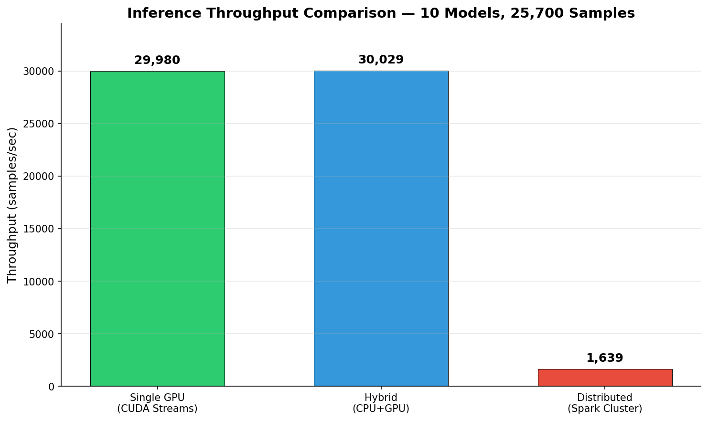
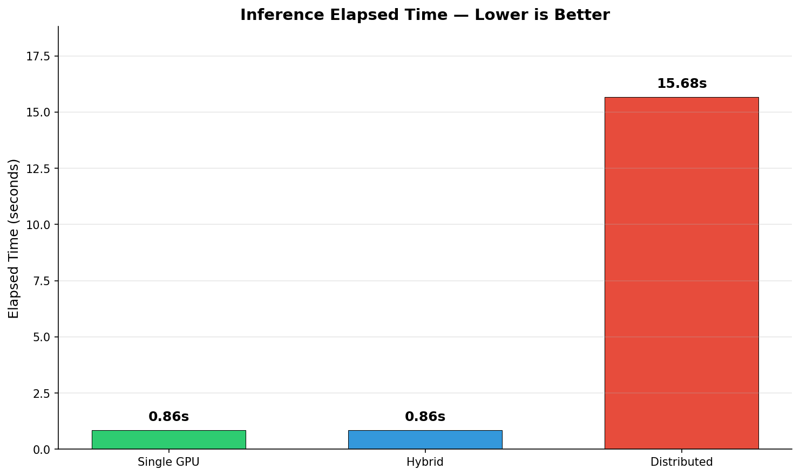
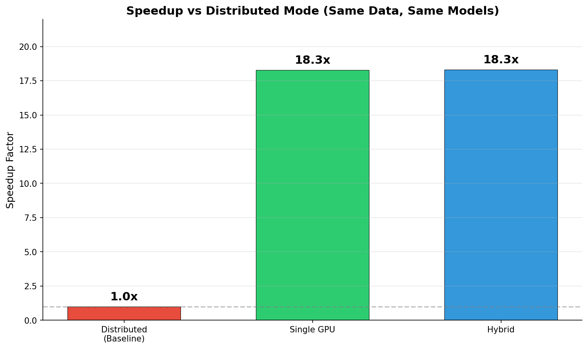
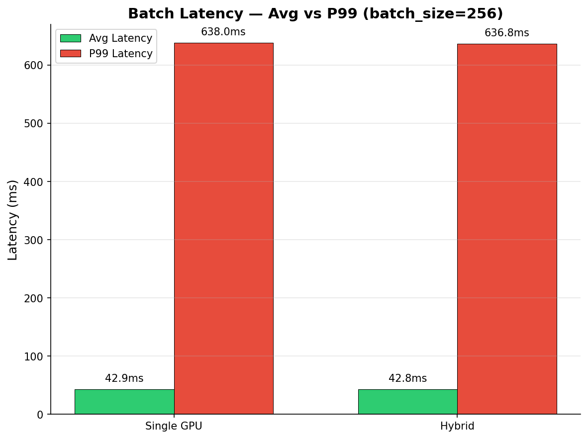
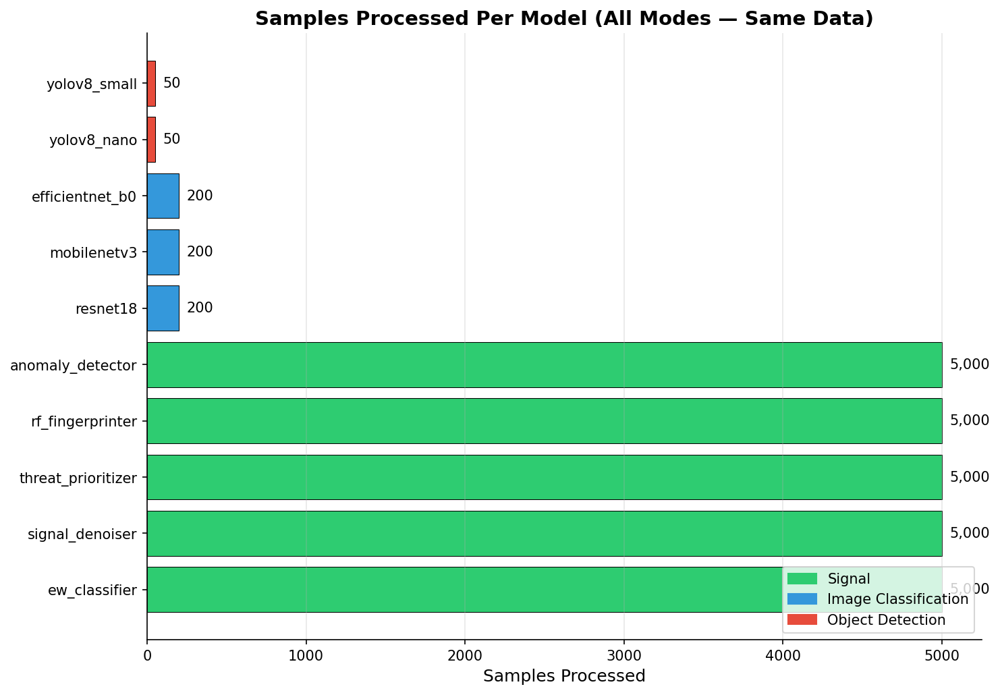
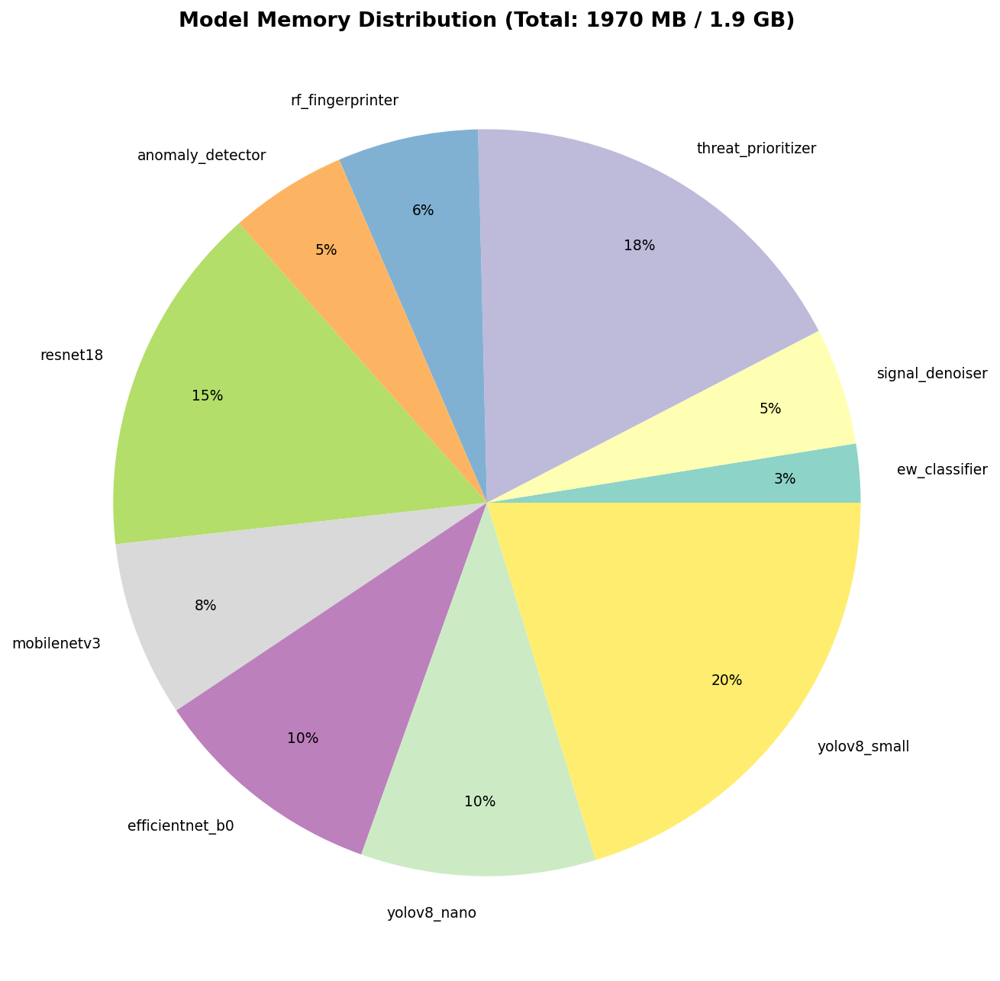

# Multi-Model Inference Benchmark Report

**Date:** 2026-07-19
**Platform:** Amazon Linux 2023 (AWS EC2)
**Cluster:** 1x t3.large (master/CPU) + 1x g4dn.xlarge (GPU worker)

---

## System Configuration

| Component | Master (Driver) | GPU Worker |
|-----------|----------------|------------|
| Instance | t3.large | g4dn.xlarge |
| CPU Cores | 2 | 4 |
| GPU | N/A | Tesla T4 (15.6 GB) |
| CUDA | No | Yes |
| PyTorch | 2.2.0+cu121 | 2.2.0+cu121 |
| Spark | 3.5.1 (standalone cluster) | 3.5.1 (worker) |

## Models (10)

| Model | Category | Est. Memory |
|-------|----------|-------------|
| ew_classifier | Signal | 50 MB |
| signal_denoiser | Signal | 100 MB |
| threat_prioritizer | Signal | 350 MB |
| rf_fingerprinter | Signal | 120 MB |
| anomaly_detector | Signal | 100 MB |
| resnet18 | Image Classification | 300 MB |
| mobilenetv3 | Image Classification | 150 MB |
| efficientnet_b0 | Image Classification | 200 MB |
| yolov8_nano | Object Detection | 200 MB |
| yolov8_small | Object Detection | 400 MB |

**Total GPU Memory Required:** 1,970 MB (1.9 GB)

---

## Benchmark Results Summary

| Mode | Throughput | Elapsed Time | Speedup |
|------|-----------|-------------|---------|
| Single GPU (CUDA Streams) | **29,980** samples/sec | 0.86s | 18.3x |
| Hybrid CPU+GPU | **30,029** samples/sec | 0.86s | 18.3x |
| Distributed (Spark, 2 partitions) | **1,639** samples/sec | 15.68s | 1.0x (baseline) |

**Data:** 25,700 total samples (5,000 signals/model + 200 images + 50 detections)
**Batch Size:** 256

---

## Throughput Comparison

## Elapsed Time

## Speedup Factor (vs Distributed Baseline)

## Batch Latency (GPU Modes)

| Mode | Avg Batch Latency | P99 Batch Latency |
|------|-------------------|-------------------|
| Single GPU | 42.86 ms | 638.02 ms |
| Hybrid | 42.79 ms | 636.76 ms |

## Per-Model Sample Distribution

## Model Memory Allocation

---

## Analysis

### Why Single GPU is Fastest
- All 10 models fit in the T4's 15.6 GB VRAM (only 1.97 GB needed)
- CUDA streams enable concurrent model execution without serialization overhead
- No network transfer, no data partitioning, no Spark coordination

### Why Hybrid Matches Single GPU
- All 10 models fit in GPU memory, so the hybrid scheduler places everything on GPU
- 0 models spill to CPU — effectively becomes single GPU mode
- Hybrid shines when GPU VRAM is limited (e.g., only 4 GB available)

### When Distributed Mode Wins
- Distributed mode's overhead (serialization, data partitioning, network) makes it slower for small datasets
- It becomes advantageous with:
  - Datasets > 100K samples (amortizes Spark startup cost)
  - Multiple GPU workers (linear throughput scaling)
  - Models too large for a single GPU (spread across nodes)

### Recommendations for Production EW Systems
1. **Single workstation with 1 GPU:** Use Single GPU mode (CUDA Streams)
2. **GPU memory constrained:** Use Hybrid mode (auto-spills large models to CPU)
3. **Multi-node cluster, large-scale data:** Use Distributed mode with 1 partition per GPU worker
4. **Real-time streaming:** Single GPU + TensorRT for lowest latency

---

## Environment Details

- Spark Master: `spark://10.0.0.187:7077`
- Workers: 2 (1 CPU @ t3.large, 1 GPU @ g4dn.xlarge)
- Docker Image: `multi-model-inference:latest` (CUDA 12.1 + PyTorch 2.2 + Spark 3.5.1)
- Region: ap-south-1 (Mumbai)
